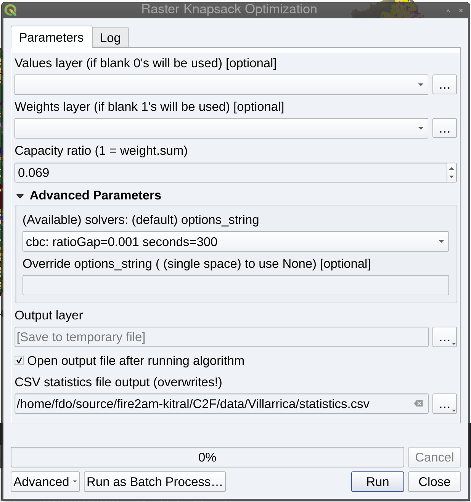

     Forest Fires Advanced Analytics & Management Tools
        
           QGIS Processing Plugin Template
                
            by fire2a.com research centre

                     version=0.0.1

This repo is a template to [QGIS plugin](https://plugins.qgis.org/) processing toolbox plugins.

Its main content is an integration between QGIS rasters and a knapsack optimization MIP.

Users can create a new raster layer that selects the most valuable pixels in a raster, according to a capacity constraint defined by another -optional- raster and a fractional ratio. This can be achieved graphically by the processing tool box interface, or programatically via python scripts and the processing module provided by qgis.

Finally several solvers can be used (cbc, glpk, cplex_direct, ipopt, TODO gurobi, scipy), because the MIP is modeled through [pyomo](http://www.pyomo.org). Though is up to the user to install them, the plugin checks for availability before displaying them in the solver chooser comboBox. Also a solver options string is optionally configurable (i.e., set precision and time limits)

__Installation [here](./plugin_installation.md)__
__Plugin repo link [here](./plugins.xml)__



# Usage
## Graphical
1. Open QGIS Processing Toolbox (the cog icon)
2. Type or navigate to Fire2a > Raster Knapsack Optimization
3. Select one or two layers, input the fraction ratio
4. Click Run

## Script in Qgis Console
```
from qgis import processing
result = processing.run(
    "Fire2a:Raster Knapsack Optimization",
    {
        "INPUT_ratio": 0.06,
        "INPUT_value": "/path/to/raster.any_supported_extension",
        "INPUT_weight": None,
        "OUTPUT_csv": "TEMPORARY_OUTPUT",
        "OUTPUT_layer": "TEMPORARY_OUTPUT",
        "SOLVER": "cbc: ratioGap=0.001 seconds=300",
        "CUSTOM_OPTIONS_STRING": "",
    },
)
QgsProject.instance().addMapLayer(result['OUTPUT_layer'])
```

